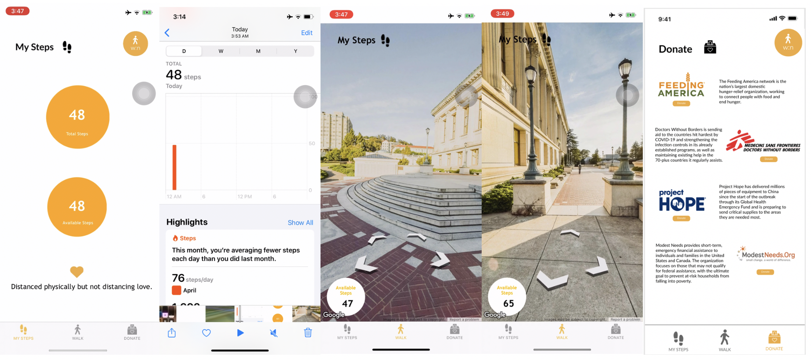

# walk-now-app

Repository for the walk:now project for the hack:now hackathon, April 24-26, 2020.

Hackers: Linda Deng, Rachel Li, Megan Zhu

## App Screenshots

## Inspiration

Given the COVID-19 situation, many of us are unable to go outside and enjoy a walk like we normally would. We are limited to our immediate neighborhood and unable to explore new places; we also miss familiar places such as our college campuses. Many people also tend to be physically inactive while sheltering in place, with very low step counts. 

## What it does

We created an iOS app to simulate the process of taking a walk, specifically around our UC Berkeley college campus. The app reads in the number of steps you have taken today in real life from your Apple Health app, and allows you to take the corresponding number of steps in Google Street View mode. 

## How I built it

We built the app using Swift and XCode. We also worked with the Google Maps API (Maps SDK for iOS) to generate the Street View for walking around, and used Apple Healthkit to fetch data on the number of steps taken. We also used Figma to create a [mockup](https://www.figma.com/file/xBiTjGFFJ2g5M6BwepKj9d/walk%3Anow?node-id=1%3A2).

## Challenges I ran into

The main challenge for us was coming in with little experience in iOS development. Only one of us had a little experience using Swift and XCode, so we all had to learn a new IDE and programming language within one weekend. Another challenge was having to cut down on the functionality that we were realistically able to implement within the given timeframe. 

## Accomplishments that I'm proud of

We are all extremely proud of each other for learning new technologies, finishing the project, and creating an impactful product that we are all passionate about. 

## What I learned

Not only have we learned new technologies (Swift, XCode, various APIs), we learned how to work effectively with a team (especially remotely) — the importance of clear communication, writing readable code and comments, and also to be patient and trust each other and ourselves. 

## What's next for walk:now

We would like the app to be able to save the number of steps you've taken all time (not just for the given day), provide more location options to better simulate virtual travel, and allow users to trade in steps for donations to organizations fighting COVID-19. 
